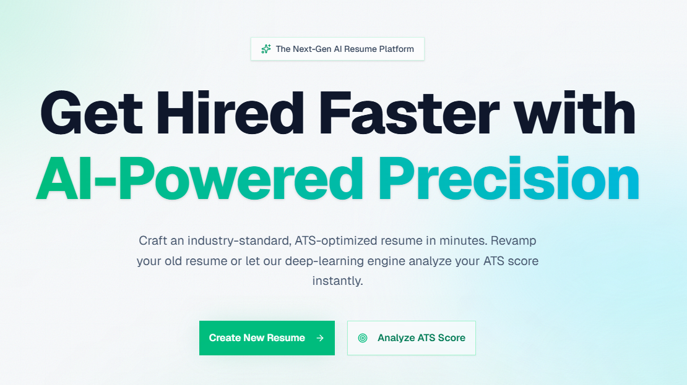

# AI Resume Builder & Optimizer

<p align="center">
  
</p>

Welcome to **AI Resume**, the ultimate platform for building, optimizing, and checking your resume against Applicant Tracking Systems (ATS). Powered by cutting-edge AI, this application helps job seekers create professional resumes that stand out and get through the filters.



## 🚀 Key Features

- **AI-Powered Resume Builder**: Create professional, high-standard resumes from scratch with AI-guided content suggestions.
- **Resume Optimizer**: Upload your existing resume and a job description to get tailored optimizations that match the specific role.
- **ATS Checker**: Evaluate your resume's compatibility with modern ATS filters and get actionable insights to improve your score.
- **Real-time Preview**: See your resume changes in real-time with professional themes.
- **Secure Authentication**: Built-in authentication with Supabase to keep your resumes private and accessible.
- **PDF Export**: Export your resume in high-quality PDF format with one click.

## 🛠️ Tech Stack

- **Framework**: [Next.js](https://nextjs.org/) (App Router)
- **Styling**: [Tailwind CSS 4](https://tailwindcss.com/)
- **Backend/Authentication**: [Supabase](https://supabase.com/)
- **AI Brain**: [OpenAI GPT-4](https://openai.com/)
- **Components**: [Radix UI](https://www.radix-ui.com/) & [Shadcn UI](https://ui.shadcn.com/)
- **Icons**: [Lucide React](https://lucide.dev/)
- **Language**: [TypeScript](https://www.typescriptlang.org/)

## 🏗️ Project Structure

```text
├── app/                  # Next.js App Router folders
│   ├── ats-checker/      # ATS score analysis logic
│   ├── builder/          # AI-assisted resume creation
│   ├── login/            # Authentication pages
│   ├── optimizer/        # Content optimization tools
│   └── page.tsx          # Landing page
├── components/           # Reusable UI components
│   ├── landing/          # Landing page specific sections
│   ├── ui/               # Core Shadcn components
│   └── resume/          # Resume layout and editing tools
├── lib/                  # Utility functions and shared logic
├── types/                # TypeScript interfaces and types
└── utils/                # Helper functions (API clients, formatting)
```

## 🛠️ Getting Started

To get a local copy up and running, follow these simple steps:

### Prerequisites

- Node.js 22+
- npm/pnpm/yarn
- Supabase project
- OpenAI API Key

### Installation

1. Clone the repo:
   ```bash
   git clone https://github.com/Suprabhat3/ai-resume.git
   ```
2. Install dependencies:
   ```bash
   pnpm install
   ```
3. Set up environment variables in `.env.local`:
   ```env
   NEXT_PUBLIC_SUPABASE_URL=your_supabase_url
   NEXT_PUBLIC_SUPABASE_ANON_KEY=your_supabase_key
   OPENAI_API_KEY=your_openai_key
   ```
4. Run the development server:
   ```bash
   pnpm dev
   ```

## 📈 Roadmap

- [ ] Multi-template support
- [ ] AI-powered cover letter generator
- [ ] Job application tracking system
- [ ] LinkedIn profile optimization tips

## 🤝 Contributing

Contributions are what make the open-source community such an amazing place to learn, inspire, and create. Any contributions you make are **greatly appreciated**.

1. Fork the Project
2. Create your Feature Branch (`git checkout -b feature/AmazingFeature`)
3. Commit your Changes (`git commit -m 'Add some AmazingFeature'`)
4. Push to the Branch (`git push origin feature/AmazingFeature`)
5. Open a Pull Request

## 📄 License

Distributed under the MIT License. See `LICENSE` for more information.

---

Built with ❤️ by [Suprabhat3](https://github.com/Suprabhat3)
